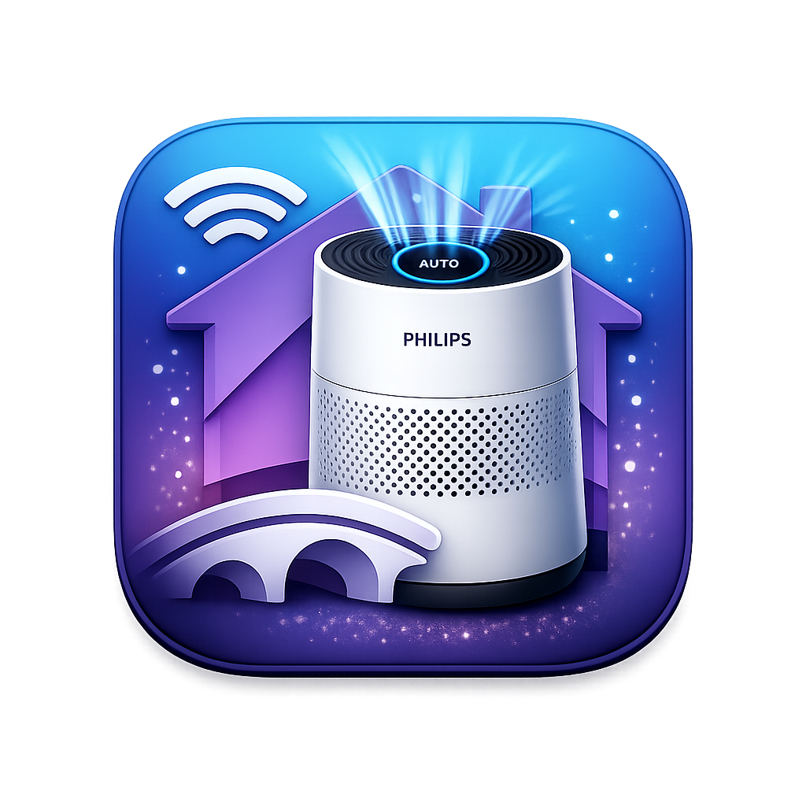

# Homebridge Philips Air Purifier AC1715

<p align="center">
  
</p>

<p align="center">
  
  <a href="https://homebridge.io"></a>
  <a href="LICENSE"></a>
</p>

Maintained Homebridge fork for reliable local control of the Philips AC1715/10.
It uses a stable CoAP transport, confirms commands against device-reported state,
and restores cached state promptly after a Homebridge restart.

This repository is based on
[MaddogWarner/homebridge-philips-air-purifier-complete](https://github.com/MaddogWarner/homebridge-philips-air-purifier-complete)
and retains its MIT license and upstream history. The npm package name is
intentionally unchanged so existing Homebridge cached accessories keep their
plugin identity. The package is marked private, which prevents Homebridge UI
from querying npm or offering the stock package as an update.

---

## AC1715 reliability changes

- Stable local UDP port for the long-lived CoAP Observe relation
- Correct AC1715 fields for power, mode, and display light
- Device-confirmed commands instead of optimistic HomeKit acknowledgements
- 60-second heartbeat and command-time refresh for sparse Observe traffic
- Persistent raw state for immediate recovery after bridge restarts
- Trailing fan-speed debounce with serialized commands
- Source and deployment integrity checks to detect registry-package drift

## Managed Homebridge installation

Keep the checkout in Homebridge's persistent storage:

```text
/homebridge/local-plugins/homebridge-philips-air-purifier-ac1715
```

Then install and verify it from inside the Homebridge environment:

```bash
cd /homebridge/local-plugins/homebridge-philips-air-purifier-ac1715
bash scripts/install-homebridge.sh
```

The installer pins `/homebridge/package.json` to:

```text
file:local-plugins/homebridge-philips-air-purifier-ac1715
```

Run the non-mutating drift check at any time:

```bash
bash /homebridge/local-plugins/homebridge-philips-air-purifier-ac1715/scripts/verify-homebridge-install.sh
```

Do not update this plugin through Homebridge's npm plugin search. Bring upstream
changes into this repository, run the test suite, and deploy the reviewed
result with the installer.

---

## Features

- **Power On/Off** — Turn your air purifier on or off
- **4 Fan Modes** — Auto, Sleep, Medium, Turbo (via rotation speed slider)
- **Sleep Mode Switch** — Dedicated HomeKit switch that sets Sleep mode and dims the display
- **Air Quality Sensor** — Real-time PM2.5 readings with derived AQI rating
- **Display Light Control** — Toggle and 3-level brightness (Off / Dim / Bright)
- **Child Lock** — Lock or unlock physical controls on the device
- **HEPA Filter Status** — Filter life percentage and change alert
- **Pre-Filter Status** — Cleanup cycle percentage and change alert
- **HTTP Protocol Support** — Supports AC1xxx-series DH/AES HTTP models (e.g. AC1715) and HomeID/Condor local HTTP devices
- **Real-time Updates** — CoAP Observe push updates (AC2xxx+) or 10-second HTTP polling (HTTP/HomeID)
- **Auto-reconnect** — Daemon restarts automatically with exponential backoff if the device drops off

---

## Prerequisites

| Requirement | Version |
|-------------|---------|
| [Homebridge](https://homebridge.io) | >= 2.0.0 |
| Node.js | >= 24.0.0 |
| Python 3 | >= 3.12 |
| Your Philips Air Purifier's **IP address** | — |

Python 3.12 or newer must be installed on the system running Homebridge. On most platforms:

```bash
# macOS
brew install python@3.12

# Raspberry Pi / Ubuntu / Debian
sudo apt install python3.12 python3.12-venv
```

The install hook creates a plugin-local virtual environment and installs:

| Python package | Supported range |
|----------------|-----------------|
| `aiocoap` | `>=0.4.17,<0.5` |
| `pycryptodomex` | `>=3.23,<4` |

---

## Installation

Use the managed local installation described above. The plugin's existing
postinstall hook creates a local Python environment and installs the required
CoAP dependencies. `PHILIPS_AIR_PYTHON` and `pythonPath` remain available when
Homebridge needs an explicit Python 3.12+ executable.

---

## Migrating from v2.x to v3.0.0

v3.0.0 changes the plugin type from `accessory` to `platform`. Update your Homebridge
`config.json` before restarting Homebridge.

1. Move device entries from `"accessories"` into `"platforms"[0]."devices"`:

   **Before: v2.x accessory config**

   ```json
   {
     "accessories": [
       {
         "name": "Air Purifier",
         "host": "192.168.1.17",
         "accessory": "PhilipsAirPurifier"
       }
     ]
   }
   ```

   **After: v3.x platform config**

   ```json
   {
     "platforms": [
       {
         "platform": "PhilipsAirPurifier",
         "name": "Philips Air Purifiers",
         "devices": [
           {
             "name": "Air Purifier",
             "host": "192.168.1.17"
           }
         ]
       }
     ]
   }
   ```

2. Remove the `"accessory": "PhilipsAirPurifier"` key from each device entry.

3. Restart Homebridge.

From v3.2.3, old top-level `"accessory": "PhilipsAirPurifier"` entries are not loaded by
default. If Homebridge logs `Loading 1 accessories...` followed by
`Legacy accessories[] config detected`, the old entry is still present in the full Homebridge
`config.json` even if this plugin's platform settings modal only shows `{ "platform":
"PhilipsAirPurifier" }`. Remove the old object from the top-level `"accessories"` array and keep
the device under `"platforms"[]."devices"` instead. For temporary rollback only, set
`PHILIPS_AIR_ALLOW_LEGACY_ACCESSORY=1` before starting Homebridge.

### Migration examples

#### CoAP device

**Before:**

```json
{
  "accessories": [
    {
      "accessory": "PhilipsAirPurifier",
      "name": "Bedroom",
      "host": "192.168.1.100"
    }
  ]
}
```

**After:**

```json
{
  "platforms": [
    {
      "platform": "PhilipsAirPurifier",
      "name": "Philips Air Purifiers",
      "devices": [
        {
          "name": "Bedroom",
          "host": "192.168.1.100"
        }
      ]
    }
  ]
}
```

#### HTTP or HomeID device

**Before:**

```json
{
  "accessories": [
    {
      "accessory": "PhilipsAirPurifier",
      "name": "Study",
      "host": "192.168.1.102",
      "protocol": "homeid-http",
      "useHttps": true,
      "clientId": "BASE64_CLIENT_ID",
      "clientSecret": "BASE64_CLIENT_SECRET"
    }
  ]
}
```

**After:**

```json
{
  "platforms": [
    {
      "platform": "PhilipsAirPurifier",
      "name": "Philips Air Purifiers",
      "devices": [
        {
          "name": "Study",
          "host": "192.168.1.102",
          "protocol": "homeid-http",
          "useHttps": true,
          "clientId": "BASE64_CLIENT_ID",
          "clientSecret": "BASE64_CLIENT_SECRET"
        }
      ]
    }
  ]
}
```

#### Air+ cloud device

**Before:**

```json
{
  "accessories": [
    {
      "accessory": "PhilipsAirPurifier",
      "name": "Air Purifier (Air+)",
      "host": "cloud",
      "protocol": "airplus-cloud",
      "airplusDeviceUuid": "AIRPLUS_DEVICE_UUID",
      "airplusTokenFile": "/home/homebridge/.homebridge/philips-airplus-AIRPLUS_DEVICE_UUID.json"
    }
  ]
}
```

**After:**

```json
{
  "platforms": [
    {
      "platform": "PhilipsAirPurifier",
      "name": "Philips Air Purifiers",
      "devices": [
        {
          "name": "Air Purifier (Air+)",
          "host": "cloud",
          "protocol": "airplus-cloud",
          "airplusDeviceUuid": "AIRPLUS_DEVICE_UUID",
          "airplusTokenFile": "/home/homebridge/.homebridge/philips-airplus-AIRPLUS_DEVICE_UUID.json"
        }
      ]
    }
  ]
}
```

**Note:** HomeKit will treat migrated devices as new accessories. Re-add them to rooms,
scenes, and automations in the Home app.

---

## Configuration

Add to your Homebridge `config.json` under `"platforms"`:

```json
{
  "platforms": [
    {
      "platform": "PhilipsAirPurifier",
      "name": "Philips Air Purifiers",
      "devices": [
        {
          "name": "Living Room Air Purifier",
          "host": "192.168.1.100"
        }
      ]
    }
  ]
}
```

For AC1xxx models that use HTTP:

```json
{
  "platforms": [
    {
      "platform": "PhilipsAirPurifier",
      "name": "Philips Air Purifiers",
      "devices": [
        {
          "name": "Bedroom Air Purifier",
          "host": "192.168.1.101",
          "protocol": "http"
        }
      ]
    }
  ]
}
```

For HomeID/Condor local HTTP devices:

```json
{
  "platforms": [
    {
      "platform": "PhilipsAirPurifier",
      "name": "Philips Air Purifiers",
      "devices": [
        {
          "name": "Study Air Purifier",
          "host": "192.168.1.102",
          "protocol": "homeid-http",
          "useHttps": true,
          "clientId": "BASE64_CLIENT_ID",
          "clientSecret": "BASE64_CLIENT_SECRET"
        }
      ]
    }
  ]
}
```

Use the Homebridge plugin configuration form to add, edit, or remove CoAP, HTTP, HomeID, and
Air+ cloud devices. The form presents `devices[]` as one tab per purifier, with protocol-specific
fields shown only when they apply.

Air+ cloud devices also need an account token. Open **Plugin Settings**, enter the Philips account
email, complete the verification code flow, select the device, then review the new Air+ card and
click **Save Changes**.

The **JSON Config** tab remains supported for direct edits to `devices[]`. Existing v3.1
installations that still contain `additionalDevicesJson` continue to merge those entries at
runtime for backwards compatibility, but that field is no longer shown in the GUI.

### Configuration Options

| Option | Required | Default | Description |
|--------|----------|---------|-------------|
| `platform` | Yes | — | Must be `PhilipsAirPurifier` in the platform entry. |
| `name` | No | `Philips Air Purifiers` | Platform name for the Homebridge UI. |
| `devices` | Yes | `[]` | Array of purifier device entries. |
| `devices[].name` | Yes | — | Name shown in HomeKit. |
| `devices[].host` | Yes, except Air+ | — | IPv4 address of your purifier. Use `cloud` for `airplus-cloud`. |
| `devices[].protocol` | No | `coap` | Communication protocol. Use `http` for AC1xxx DH/AES models, `homeid-http` for HomeID/Condor local HTTP devices, or `airplus-cloud` for Philips Air+ cloud devices. |
| `devices[].useHttps` | No | `false` | Use HTTPS for `homeid-http` devices with self-signed certificates. Ignored for `coap` and `http`. |
| `devices[].clientId` | No | — | Base64 HomeID local API client ID for PhilipsCondor challenge authentication. |
| `devices[].clientSecret` | No | — | Base64 HomeID local API client secret for PhilipsCondor challenge authentication. |
| `devices[].encryptionKey` | No | Auto-fetched when possible | Optional hex AES key for HomeID encrypted payloads. Leave blank unless you already know it. |
| `devices[].airplusDeviceUuid` | Yes for Air+ | — | Philips Air+ device UUID. Filled automatically by the setup wizard. |
| `devices[].airplusTokenFile` | No | `~/.homebridge/philips-airplus-{uuid}.json` | Token file written by the setup wizard or CLI setup script. |
| `devices[].pythonPath` | No | Auto-detected | Path to Python 3.12 or newer with `aiocoap` and `pycryptodomex` installed. Leave blank to use the plugin's bundled virtual environment. |
| `additionalDevicesJson` | No | — | Legacy v3.1 runtime fallback. Additional entries are still merged with `devices[]`, but this field is no longer shown in the GUI. |

### Model Compatibility

| Protocol | Models | Notes |
|----------|--------|-------|
| `coap` (default) | AC2xxx, AC3xxx, AC4xxx | CoAP Observe push updates |
| `http` | AC1xxx DH/AES models (e.g. AC1715) | HTTP polling every 10 seconds via `/air` |
| `homeid-http` | HomeID/Condor local HTTP devices | HTTP/HTTPS polling every 10 seconds via `/status`, `/air`, and `/fltsts` |
| `airplus-cloud` | Devices registered in the Philips Air+ app | Cloud MQTT updates via the Air+ account token |

If your device shows `Network error: NetworkError` on every command, try setting `"protocol": "http"` in that device entry.

---

## Air+ Cloud Setup (AC0650, AC1715)

### Quick Setup (Homebridge UI — recommended)

1. Install the plugin via the Homebridge UI
2. Go to **Plugins → Philips Air Purifier → Plugin Settings**
3. Enter the email address for your Philips Air+ account
4. Click **Send Code**
5. Enter the verification code from the email and click **Verify & List Devices**
6. Click **Add Device** next to your purifier
7. Review the new Air+ device card and click **Save Changes**
8. Restart Homebridge

Each device needs its own setup run. Run through the wizard once per purifier.

The older browser redirect-copy login remains available under
**Advanced: log in via browser**. Use it only as a fallback; the email verification code flow avoids
the desktop deep-link mismatch that can produce `invalid_grant` errors.

Deleting an Air+ device from the Homebridge form removes it from the Homebridge config only. The
token file is intentionally left on disk at `~/.homebridge/philips-airplus-{uuid}.json` so an
accidental delete does not revoke local setup state. Remove that file manually if you are cleaning
up an Air+ device permanently.

### Advanced / Headless Setup (SSH)

If your Homebridge host has no browser access (Docker, NAS, headless Raspberry Pi):

```bash
cd /path/to/homebridge-philips-air-purifier-complete
source .venv/bin/activate
python scripts/airplus_setup.py
```

Follow the on-screen instructions. The script sends an email verification code, saves a token file to
`~/.homebridge/philips-airplus-{uuid}.json` and prints the Homebridge config to add.

To use the legacy browser redirect-copy fallback instead:

```bash
python scripts/airplus_setup.py --browser
```

---

## Connectivity Check (optional)

Before configuring Homebridge, you can verify the plugin can reach your device:

```bash
# Activate the plugin's virtual environment
source $(npm root -g)/homebridge-philips-air-purifier-complete/.venv/bin/activate

# Run a sensor query
python $(npm root -g)/homebridge-philips-air-purifier-complete/philips_air_api.py 192.168.1.100 sensors

# Probe HomeID local HTTP endpoints without changing device state
python $(npm root -g)/homebridge-philips-air-purifier-complete/philips_air_api.py 192.168.1.100 probe-homeid
python $(npm root -g)/homebridge-philips-air-purifier-complete/philips_air_api.py 192.168.1.100 probe-homeid --use-https
```

You should see a JSON payload with PM2.5, filter life, temperature, and so on. CoAP can be flaky on the first connection — re-run if you get a timeout.

---

## HomeKit Tiles

Once configured, your air purifier appears in the Apple Home app with:

| Tile | What It Controls |
|------|-----------------|
| Air Purifier | Power, Auto/Manual mode, fan speed (Sleep / Medium / Turbo) |
| Sleep Mode | Switch that activates Sleep mode and dims the display |
| Air Quality | PM2.5 density and derived AQI rating |
| Display Light | On/off toggle and 3-level brightness |
| Child Lock | Lock/unlock physical controls on the device |
| HEPA Filter | Remaining filter life percentage, change alert below 10% |
| Pre-Filter | Cleanup cycle status, change alert below 10% |

---

## Architecture

```
Homebridge (Node.js)
    │
    │  stdin/stdout JSON
    │
    ▼
philips_air_api.py  ─── aioairctrl/ (bundled) ──► aiocoap ──► Philips device (CoAP)
    │
    ├──────────────────── DH/AES HTTP polling ──────────────► Philips device (HTTP)
    │
    └──────────────────── HomeID HTTP/HTTPS polling ────────► Philips device (HomeID)
    │
    │  CoAP Observe (push)
    │  ≈ every 30s or on change
    │  HTTP polling every 10s
    ▼
State cache ──► HomeKit characteristics
```

- The Python daemon maintains a **CoAP Observe** subscription to the device
- For HTTP models, the Python daemon polls the local API every 10 seconds
- HomeID mode polls `status`, `air`, and `fltsts`, and supports PhilipsCondor challenge authentication
- Commands (power, mode, light) are sent directly and complete in ~100–300ms
- The Node.js plugin communicates with the daemon over stdin/stdout JSON
- If the daemon exits for any reason, Homebridge restarts it with exponential backoff (5s → 10s → 30s → 60s)

---

## CLI Tool

The bundled Python script can be used standalone for diagnostics:

```bash
python3.12 philips_air_api.py 192.168.1.100 sensors
python3.12 philips_air_api.py 192.168.1.100 status
python3.12 philips_air_api.py 192.168.1.100 power on
python3.12 philips_air_api.py 192.168.1.100 power off
python3.12 philips_air_api.py 192.168.1.100 mode auto
python3.12 philips_air_api.py 192.168.1.100 mode sleep
python3.12 philips_air_api.py 192.168.1.100 mode medium
python3.12 philips_air_api.py 192.168.1.100 mode turbo
python3.12 philips_air_api.py 192.168.1.100 light 0      # off
python3.12 philips_air_api.py 192.168.1.100 light 115    # dim
python3.12 philips_air_api.py 192.168.1.100 light 123    # bright
python3.12 philips_air_api.py 192.168.1.100 childlock on
python3.12 philips_air_api.py 192.168.1.100 childlock off
```

---

## Troubleshooting

**Plugin loads but device is "No Response" in HomeKit**
- Verify the IP address is correct and the device is on the same network
- Run the connectivity check above
- Check Homebridge logs for daemon error messages

**Python setup failed during install**
- Ensure Python 3.12+ and the matching `venv` package are installed, then re-run `bash postinstall.sh`

**Preinstall warnings**
- Warnings about Node.js mean `node --version` did not report v24.0.0 or newer during install
- Warnings about Python mean `python3.12 --version` or `python3 --version` did not report Python 3.12 or newer during install
- If Python 3.12+ is installed but not visible to npm, install with `PHILIPS_AIR_PYTHON=/absolute/path/to/python3.12 npm install -g homebridge-philips-air-purifier-complete`
- If Python can only be configured after install, set `pythonPath` in the Homebridge plugin configuration before starting Homebridge

**Persistent CoAP timeouts**
- CoAP (UDP) can be blocked by some network configurations; ensure UDP is allowed between Homebridge and the device
- Assign a static IP to the device in your router's DHCP settings

**`Network error: NetworkError` on every command**
- Your device may use HTTP instead of CoAP. Set `"protocol": "http"` for AC1xxx DH/AES models such as AC1715.
- If your device responds to HomeID local HTTP endpoints or PhilipsCondor authentication challenges, use `"protocol": "homeid-http"` and configure `clientId` / `clientSecret` if required.

---

## Versioning

This project follows [Semantic Versioning](https://semver.org/). See [CHANGELOG.md](CHANGELOG.md) for the full history.

---

## License

MIT — see [LICENSE](LICENSE).

---

## Credits and Attribution

This project is a combined and enhanced fork of two open-source projects:

| Project | Author | Licence |
|---------|--------|---------|
| [louiscrc/homebridge-philips-air-purifier](https://github.com/louiscrc/homebridge-philips-air-purifier) | [louiscrc](https://github.com/louiscrc) | MIT |
| [betaboon/aioairctrl](https://github.com/betaboon/aioairctrl) | [betaboon](https://github.com/betaboon) | MIT |

See [CONTRIBUTORS.md](CONTRIBUTORS.md) for the full contributor list.

---

## Support

- **Issues:** [GitHub Issues](https://github.com/MaddogWarner/homebridge-philips-air-purifier-complete/issues)
- **Homebridge community:** [homebridge.io](https://homebridge.io)
